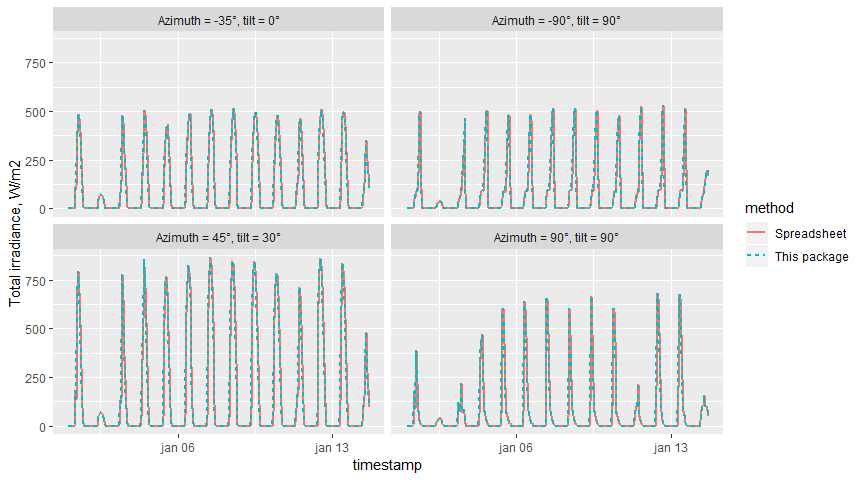

Total solar irradiance according to ISO 52010-1:2017
================
Lukas Lundström
2019-03-05

## Introduction

Total solar irradiance on a surface with arbitrary orientation and tilt,
calculated according to ISO 52010-1:2017
[\[2\]](https://www.iso.org/standard/65703.html "Energy performance of buildings -- External climatic conditions -- Part 1: Conversion of climatic data for energy calculations (ISO 52010-1:2017).").
This code was originally developed as part of this article
[\[1\]](https://doi.org/10.3390/en12030485 "Lundström, Lukas, Jan Akander, and Jesús Zambrano. 2019. Development of a Space Heating Model Suitable for the Automated Model Generation of Existing Multifamily Buildings -- A Case Study in Nordic Climate. Energies 12 (3).").

Currently only available via GitHub, install by:

``` r
if (!require('devtools')) install.packages('devtools')
#> Loading required package: devtools
devtools::install_github("lukas-rokka/solarCalcISO52010")
#> Skipping install of 'solarCalcISO52010' from a github remote, the SHA1 (7b4b54fb) has not changed since last install.
#>   Use `force = TRUE` to force installation
library(solarCalcISO52010)
```

The code is written in C++, so C++ compilation toolchain need to be
installed to be able to install this package.

<https://github.com/lukas-rokka/ISO14N_example> has some further example
code on how to use this package for building energy simulation purposes.
The [`camsRad` R-package](https://github.com/ropensci/camsRad) can be
used to acquire satellite-based solar irradiance data from
[CAMS](http://www.soda-pro.com/web-services/radiation/cams-radiation-service).

## Validation

The ‘tests/testthat/test\_data.csv.gz’ file holds climate data from the
ISO 52010 standard: station DRYCOLD.TMY (Denver, USA), latitude = 39.76,
longitude = -104.86, time zone = -7. The file also has validation cases
calculated with the
[ISO\_FDIS\_52010\_SS\_ISO-TC163-SC2-WG15\_N0075\_20160705.xlsm](https://epb.center/support/resources/spreadsheets)
spreadsheet provided with the standard. The result of the cases are
stored in the following four variables: \* I\_tot\_s1: azimuth=90, tilt
angle=90 \* I\_tot\_s2: azimuth=-90, tilt angle=90 \* I\_tot\_s3:
azimuth=-35, tilt angle=0 \* I\_tot\_s4: azimuth=45, tilt angle=30

``` r
df <- read.csv("tests/testthat/test_data.csv.gz")

df$timestamp = seq.POSIXt(as.POSIXct("2014-01-01 01:00", tz="Etc/GMT+7"), 
                          as.POSIXct("2015-01-01 00:00", tz="Etc/GMT+7"), by="hour")

df$albedo = 0.2

df2 <- solarCalcISO52010:::tidyISO52010(
  df, 
  lat=39.76, 
  lng=-104.86, 
  tz=-7, 
  t_shift=0.5, 
  surfaceAzimuths = c(90, -90, -35, 45), 
  surfaceTilts = c(90, 90, 0, 30),
  interp_perez = 0 # the validation data is calc with binned Perez data
  ) 

df2$I_tot_s1 = df2$I_tot_dir_s1 + df2$I_tot_dif_s1
df2$I_tot_s2 = df2$I_tot_dir_s2 + df2$I_tot_dif_s2
df2$I_tot_s3 = df2$I_tot_dir_s3 + df2$I_tot_dif_s3
df2$I_tot_s4 = df2$I_tot_dir_s4 + df2$I_tot_dif_s4
df2$alpha_sol = df2$alpha_sol*180/pi


df2 %>% mutate(method="This package") %>% 
  bind_rows(df %>% mutate(method="Spreadsheet")) %>% 
  as_tibble() %>% 
  filter(timestamp < as.POSIXct("2014-01-15 01:00")) %>% 
  select(timestamp, method, 
         'Azimuth = 90°, tilt = 90°' = I_tot_s1, 
         'Azimuth = -90°, tilt = 90°' = I_tot_s2, 
         'Azimuth = -35°, tilt = 0°' = I_tot_s3, 
         'Azimuth = 45°, tilt = 30°' = I_tot_s4) %>%
  gather(case, I, -timestamp, -method) %>%
  ggplot(aes(timestamp, I, color=method, linetype=method)) + 
  facet_wrap(~case,ncol=2) +
  geom_line(size=1) +
  labs(y="Total irradiance, W/m2")
```

<!-- -->

## Licensing

All C++ code is licensed under the New BSD License. All R code is
licensed under the GPL-2 License. All documentation is licensed CC-BY.

## References

1.  Lundström, Lukas, Jan Akander, and Jesús Zambrano. 2019.
    “Development of a Space Heating Model Suitable for the Automated
    Model Generation of Existing Multifamily Buildings – A Case Study in
    Nordic Climate”. Energies 12 (3).
    <https://doi.org/10.3390/en12030485>

2.  ISO 52016-1:2017. “Energy performance of buildings – External
    climatic conditions – Part 1: Conversion of climatic data for energy
    calculations (ISO 52010-1:2017)”
    <https://www.iso.org/standard/65703.html>
